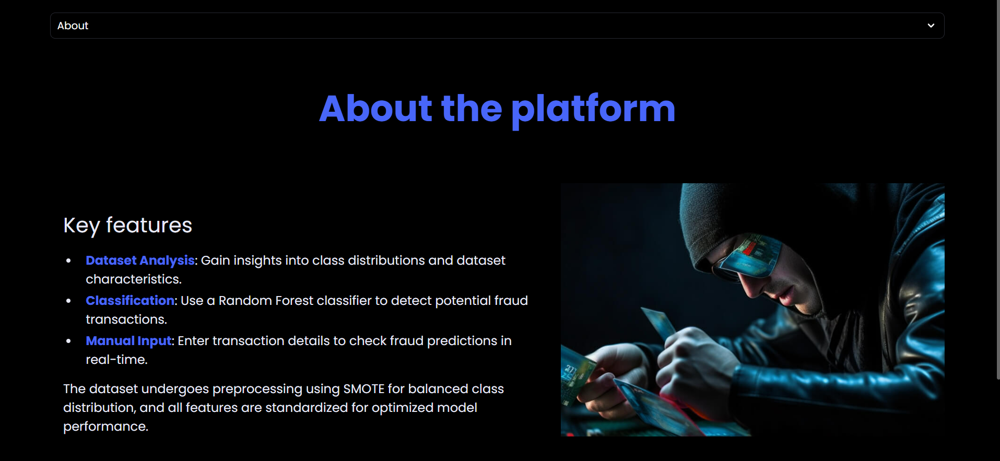
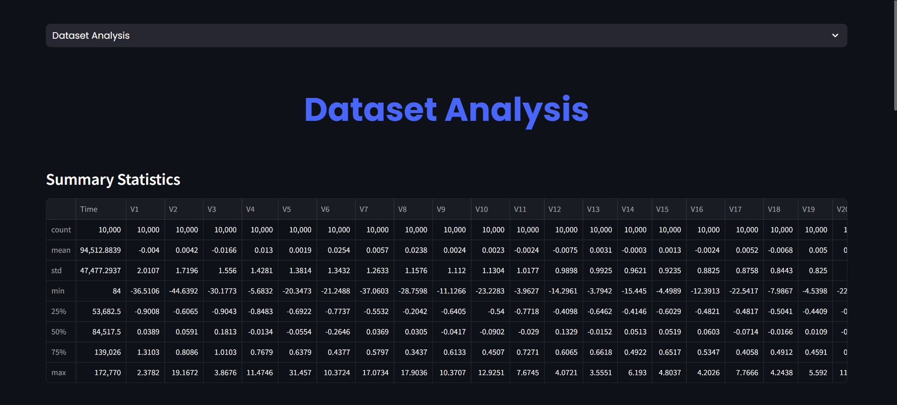
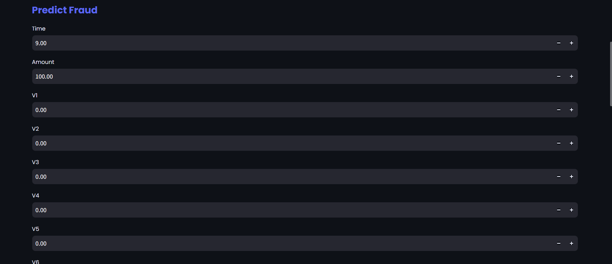
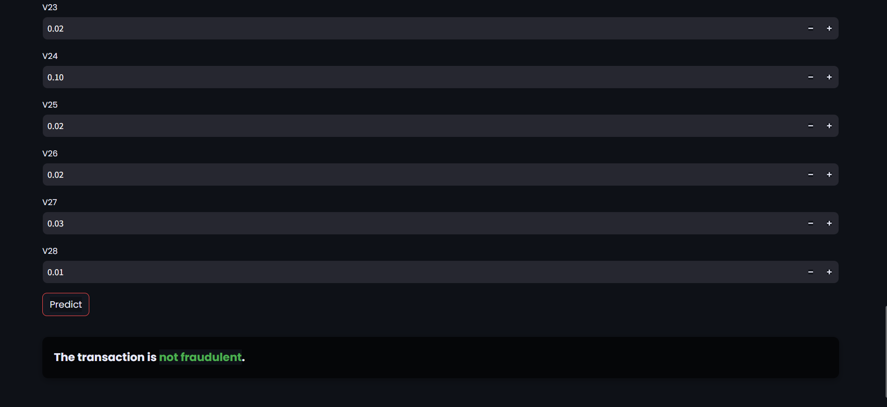
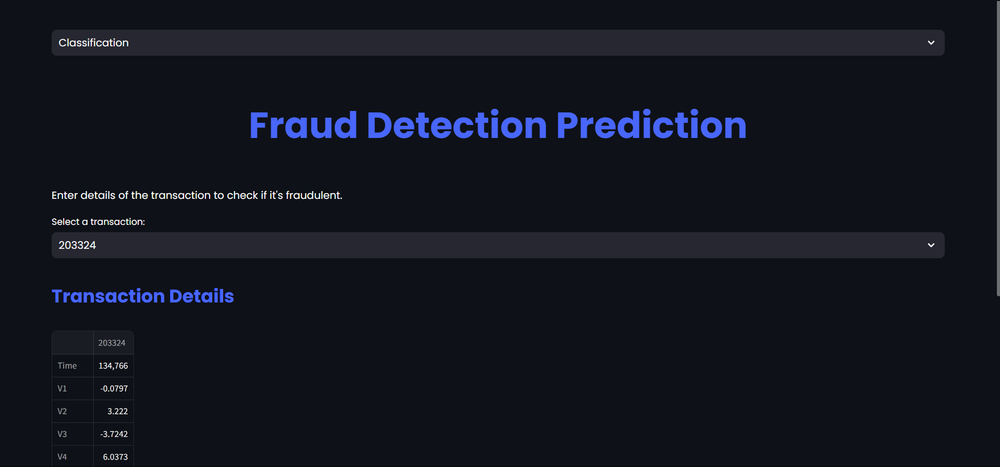
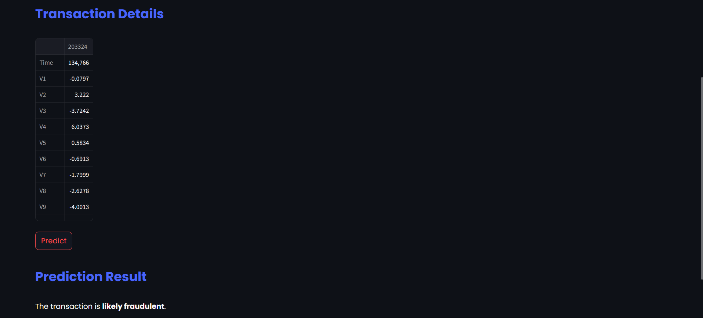

# 💳 Credit Card Fraud Detection App

An end-to-end Machine Learning project that detects fraudulent credit card transactions in real-time.  
Built with **Python**, **Streamlit**, and **Scikit-learn**, this app applies advanced ML models to identify anomalies and protect against fraud.

---

## 🚀 Features
- **Real-Time Prediction** – Detect fraud instantly when transaction details are entered.
- **Machine Learning Pipeline** – Trained with Random Forest Classifier for high accuracy.
- **Imbalanced Data Handling** – Applied **SMOTE** (Synthetic Minority Oversampling Technique) to improve fraud detection performance.
- **User-Friendly Interface** – Built with **Streamlit** for an interactive web app experience.
- **Scalable Design** – Can integrate with APIs for production deployment.

---

## 📂 Project Structure
```
credit-card-fraud-detection/
│
├── data/
│ └── creditcard.csv # Original dataset
├── model/
│ └── fraud_detection_model.pkl # Saved ML model
├── app.py # Streamlit frontend app
├── requirements.txt # Python dependencies
└── README.md # Project documentation
```

---

## 📊 Dataset
- **Source:** [Kaggle – Credit Card Fraud Detection Dataset](https://www.kaggle.com/mlg-ulb/creditcardfraud)
- **Description:** Contains transactions made by European cardholders in September 2013.
- **Size:** 284,807 transactions, 492 fraud cases (highly imbalanced).

---

## ⚙️ Installation & Usage

### 1️⃣ Clone Repository
```bash
git clone https://github.com/KhushiY215/credit-card-fraud-detection.git
cd credit-card-fraud-detection
```
### 2️⃣ Install Dependencies
```bash
Copy code
pip install -r requirements.txt
```
### 3️⃣ Run the App
```bash
Copy code
streamlit run app.py
```

---

### 🧠 Machine Learning Workflow
- Data Preprocessing
- Standardization using StandardScaler
- Train-test split (80-20)
- Handling Class Imbalance
- Used SMOTE to oversample minority (fraud) class
- Model Training
- Random Forest Classifier tuned for maximum recall
- Evaluation Metrics
- Accuracy, Precision, Recall, F1-Score, ROC-AUC

---

### 📈 Model Performance
- Metric	Score
- Accuracy	94.7%
- Precision	94.8%
- Recall	92.4%
- F1 Score	93.6%
- ROC-AUC	0.998

### ⚡ Note: Recall is prioritized to reduce false negatives (missed frauds).

---

### 💻 Tech Stack
- **Language: Python**
- **Libraries: Pandas, NumPy, Scikit-learn, Imbalanced-learn, Streamlit**
- **ML Algorithm: Random Forest Classifier**
- **Data Handling: SMOTE for imbalance correction**

---

## Screenshots








---


### 📌 Future Enhancements
✅ Deploy on Heroku or Render for public access

✅ Integrate with real transaction APIs for live fraud detection

✅ Add explainable AI (SHAP) for model transparency

---

### 👨‍💻 Author
Khushi


